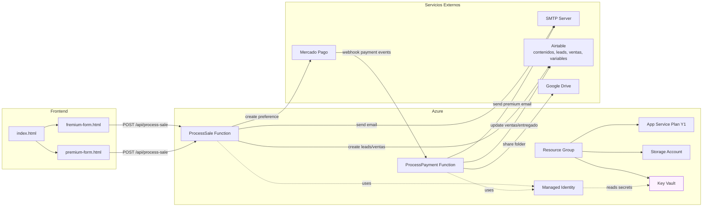

# 🏗️ Arquitectura: Bartolo Profe App

## Diagrama (Mermaid)



## Diagrama General

```
┌─────────────────────────────────────────────────────────────────────────┐
│                         USUARIOS (Web)                                  │
│  ┌──────────────────────────────────────────────────────────────────┐  │
│  │  el-profe-bartolo/index.html                                     │  │
│  │  - Botón "Contenido gratuito" → fremium-form.html               │  │
│  │  - Botón "Comprar (S/ X)" → premium-form.html                   │  │
│  └────────────────┬────────────────────────────────────────────┬───┘  │
│                   │                                            │        │
└───────────────────┼────────────────────────────────────────────┼────────┘
                    ↓                                            ↓
┌─────────────────────────────────────────────────────────────────────────┐
│                         AZURE FUNCTIONS                                 │
│  ┌────────────────────────────────────────────────────────────────────┐ │
│  │  ProcessSale (Node.js 20)                                          │ │
│  │  POST /api/process-sale                                            │ │
│  │  ────────────────────────────────────────────────────────────────  │ │
│  │  Input:                                                            │ │
│  │  - email (string)                                                  │ │
│  │  - nombre (string)                                                 │ │
│  │  - contenido (string - ID)                                         │ │
│  │  - dni (string - solo para premium)                                │ │
│  │  - premium (boolean)                                               │ │
│  │                                                                    │ │
│  │  Lógica:                                                           │ │
│  │  1. Parsear input → validar campos                                │ │
│  │  2. Crear record en tabla "leads"                                  │ │
│  │  3. Si premium:                                                    │ │
│  │     a) Crear record en tabla "ventas"                              │ │
│  │     b) Lookup en tabla "variables" para obtener URL                │ │
│  │     c) Generar payment link en Mercado Pago                        │ │
│  │     d) Enviar email con link de pago                              │ │
│  │  4. Si NO premium:                                                 │ │
│  │     a) Enviar email con contenido gratuito                         │ │
│  │                                                                    │ │
│  │  Output:                                                           │ │
│  │  - 200: { success: true, message: "..." }                         │ │
│  │  - 400/500: Error details                                         │ │
│  └────────────────┬─────────────────────────────────────────────────┘ │
│                   │                                                    │
│  ┌────────────────▼─────────────────────────────────────────────────┐ │
│  │  ProcessPayment (Node.js 20) - WEBHOOK                            │ │
│  │  POST /api/webhook/{ventaid}                                      │ │
│  │  ────────────────────────────────────────────────────────────────  │ │
│  │  Trigger: Notificación de Mercado Pago                            │ │
│  │  Input:                                                            │ │
│  │  - {ventaid} = ID de la venta                                      │ │
│  │  - topic, resource (from Mercado Pago)                            │ │
│  │                                                                    │ │
│  │  Lógica:                                                           │ │
│  │  1. Validar webhook de Mercado Pago                                │ │
│  │  2. Obtener detalles de venta desde Airtable                      │ │
│  │  3. Actualizar estado a "pagado"                                   │ │
│  │  4. Enviar email con URL de contenido premium                      │ │
│  │  5. Compartir carpeta en Google Drive                              │ │
│  │  6. Marcar como "entregado"                                        │ │
│  │                                                                    │ │
│  │  Output:                                                           │ │
│  │  - 200: Payment processed                                          │ │
│  │  - 400/500: Error details                                         │ │
│  └────────────────┬─────────────────────────────────────────────────┘ │
│                   │                                                    │
└───────────────────┼────────────────────────────────────────────────────┘
                    │
                    ├─────────────────────────────────────┬──────────────┐
                    ↓                                     ↓              ↓
         ┌──────────────────────┐     ┌──────────────────────┐  ┌───────────────────┐
         │   KEY VAULT          │     │   AIRTABLE           │  │  GOOGLE DRIVE     │
         │  ─────────────────   │     │  ─────────────────   │  │  ─────────────────│
         │ ✓ smtp-server        │     │ appEwnUyMa7SRu54V    │  │ ✓ Service Account │
         │ ✓ smtp-username      │     │                      │  │   Credentials     │
         │ ✓ smtp-password      │     │ Tablas:              │  │ ✓ Compartir       │
         │ ✓ airtable-api-key   │     │  - contenidos        │  │   carpetas        │
         │ ✓ airtable-base-id   │     │  - contactos         │  │ ✓ Permisos        │
         │ ✓ mercado-pago-token │     │  - leads             │  └───────────────────┘
         │ ✓ google-svc-account │     │  - ventas            │
         │                      │     │  - variables         │
         └──────────────────────┘     └──────────────────────┘
                    ↑                           ↑
                    └───────────────────────────┘
                       Managed Identity
                       (Secure Access)
```

---

## 🔄 Flujos de Negocio

### Flujo 1: Contenido Gratuito (Fremium)

```
Usuario                       ProcessSale Function                Airtable
  │                                │                               │
  ├─ 1. Completa formulario        │                               │
  │  (email, nombre, contenido)    │                               │
  │                                │                               │
  ├─────────────── POST ───────────>                               │
  │                                │                               │
  │                           2. Valida                            │
  │                                │                               │
  │                           3. Crea "lead"─────────────────────>│
  │                                │                               │
  │                           4. Envía email                       │
  │                           (SMTP via Key Vault)                 │
  │                                │                               │
  │  <───────── 200 OK ────────────┤                               │
  │                                │                               │
  ├─ 5. Recibe email con           │                               │
  │    contenido gratuito           │                               │
  │                                │                               │
  │  ┌─ Botón: "Comprar Premium" ──>                               │
  │  │  (redirige a premium-form)   │                               │
  │  │                               │                               │
  │  └─ O: Descarga contenido       │                               │
```

### Flujo 2: Compra Premium

```
Usuario                    ProcessSale                Mercado Pago           Airtable
  │                             │                         │                   │
  ├─ 1. Completa formulario      │                         │                   │
  │  (email, nombre, dni,        │                         │                   │
  │   contenido, premium=true)    │                         │                   │
  │                              │                         │                   │
  ├──────────── POST ───────────>│                         │                   │
  │                              │                         │                   │
  │                         2. Valida                      │                   │
  │                              │                         │                   │
  │                         3. Crea "venta"──────────────────────────────────>│
  │                              │                         │                   │
  │                         4. Genera payment link         │                   │
  │                              ├────────────────────────>│                   │
  │                              │ create_preference()     │                   │
  │                              │<────────────────────────┤                   │
  │                              │ link + external_ref     │                   │
  │                              │                         │                   │
  │                         5. Envía email con link        │                   │
  │                              │                         │                   │
  │  <────────── {link} ────────┤                         │                   │
  │                              │                         │                   │
  ├─ 6. Click en link            │                         │                   │
  │    (abre Mercado Pago)       │                         │                   │
  │                              │                         │                   │
  ├─ 7. Completa pago            │                         │                   │
  │                              │                         │                   │
  │  ┌─ Mercado Pago webhook ───────────────────────────┐  │                   │
  │  │                                                  v  │                   │
  │  │                                  ProcessPayment    │                   │
  │  │                                      Function      │                   │
  │  │                                           │        │                   │
  │  │                                      8. getVenta──────────────────────>│
  │  │                                           │        │<────────────────┤
  │  │                                      9. Actualiza  │ (venta details)
  │  │                                         estado     │                   │
  │  │                                           │        │                   │
  │  │                                      10. Envía     │                   │
  │  │                                          email     │                   │
  │  │                                           │        │                   │
  │  │                                      11. Comparte  │                   │
  │  │                                          Drive     │                   │
  │  │                                           │        │                   │
  │  └───────── 200 OK ──────────────────────────┘        │                   │
  │                                                        │                   │
  ├─ 12. Recibe email con:                               │                   │
  │     - URL de contenido                                │                   │
  │     - Link a Google Drive (opcional)                  │                   │
  │                                                        │                   │
  └─ 13. Accede contenido premium                         │                   │
```

### Flujo 3: Google Drive (Opcional - Premium)

```
ProcessPayment Function              Google Drive API                  Google Drive
         │                                 │                               │
         ├─ 1. Obtener Service Account ───│ (from Key Vault)              │
         │    credentials                 │                               │
         │                                │                               │
         ├─ 2. Inicializar cliente ───────│                               │
         │                                │                               │
         ├─ 3. Obtener carpeta del ───────│ (lookup por contenido)        │
         │    contenido                   │                               │
         │                                │                               │
         ├─ 4. Obtener permiso de ────────│ createPermission()            │
         │    lectura para usuario        ├──────────────────────────────>│
         │                                │<───────────────────────────────┤
         │                                │                               │
         ├─ 5. Enviar email con URL ─────│                               │
         │    compartida                  │                               │
         │                                │                               │
         └─ 6. Actualizar "entregado"    │                               │
              en Airtable                 │                               │
```

---

## 📊 Estructura de Datos: Airtable

### Tabla: `contenidos` (tbljF2fnQGYL1evT4)

```
Campos:
┌─────────────────────────────────────────┐
│ ID (PRIMARY KEY)                        │ ← Usado en forms
├─────────────────────────────────────────┤
│ nombre                                  │ ← Nombre del curso
├─────────────────────────────────────────┤
│ descripcion                             │
├─────────────────────────────────────────┤
│ precio                                  │ ← Para pagos
├─────────────────────────────────────────┤
│ url_gratuita (opcional)                 │
├─────────────────────────────────────────┤
│ url_premium (opcional)                  │ ← Lookup en variables
├─────────────────────────────────────────┤
│ imagen                                  │
└─────────────────────────────────────────┘
```

### Tabla: `leads` (tblHJcHG0xImtad3x)

```
Campos:
┌─────────────────────────────────────────┐
│ ID (PRIMARY KEY)                        │
├─────────────────────────────────────────┤
│ email                                   │ ← De form
├─────────────────────────────────────────┤
│ nombre                                  │ ← De form
├─────────────────────────────────────────┤
│ contenido_id                            │ ← Link a contenidos
├─────────────────────────────────────────┤
│ fecha_creacion                          │ ← Auto
├─────────────────────────────────────────┤
│ estado                                  │ ← "pendiente", "seguimiento", etc.
└─────────────────────────────────────────┘

Ejemplo:
┌──────┬──────────────────────┬─────────┬──────────────┬────────────────────┬──────────┐
│ ID   │ email                │ nombre  │ contenido_id │ fecha_creacion     │ estado   │
├──────┼──────────────────────┼─────────┼──────────────┼────────────────────┼──────────┤
│ rec1 │ juan@example.com     │ Juan    │ contenido001 │ 2025-01-15T10:30:00│ pendiente│
│ rec2 │ maria@example.com    │ Maria   │ contenido002 │ 2025-01-15T11:45:00│ seguimiento
└──────┴──────────────────────┴─────────┴──────────────┴────────────────────┴──────────┘
```

### Tabla: `ventas` (tblxIiu45LFrqw9Ky)

```
Campos:
┌──────────────────────────────────────────┐
│ ID (PRIMARY KEY)                         │
├──────────────────────────────────────────┤
│ email                                    │ ← De form
├──────────────────────────────────────────┤
│ nombre                                   │ ← De form
├──────────────────────────────────────────┤
│ dni                                      │ ← De form (KYC)
├──────────────────────────────────────────┤
│ contenido_id                             │ ← Link a contenidos
├──────────────────────────────────────────┤
│ precio                                   │ ← Costo
├──────────────────────────────────────────┤
│ mercado_pago_id                          │ ← MP preference ID
├──────────────────────────────────────────┤
│ estado                                   │ ← "pendiente", "pagado", "entregado"
├──────────────────────────────────────────┤
│ fecha_creacion                           │ ← Auto
├──────────────────────────────────────────┤
│ fecha_pago                               │ ← Cuando MP notifica
├──────────────────────────────────────────┤
│ verificado                               │ ← true/false (validar antes de pago)
└──────────────────────────────────────────┘

Ejemplo:
┌──────┬─────────────────────┬────────┬──────────┬──────────────┬────────┬──────────────────┐
│ ID   │ email               │ nombre │ dni      │ contenido_id │ precio │ estado           │
├──────┼─────────────────────┼────────┼──────────┼──────────────┼────────┼──────────────────┤
│ vta1 │ premium@example.com │ Carlos │ 12345678 │ contenido001 │ 49.90  │ pagado           │
│ vta2 │ otro@example.com    │ Rosa   │ 87654321 │ contenido002 │ 99.90  │ entregado        │
└──────┴─────────────────────┴────────┴──────────┴──────────────┴────────┴──────────────────┘
```

### Tabla: `variables` (tblR41MvFQ7hqyCPO)

```
Campos:
┌──────────────────────────────────────────┐
│ nombre                                   │ ← Nombre del contenido
├──────────────────────────────────────────┤
│ url                                      │ ← Link de descarga o Google Drive
├──────────────────────────────────────────┤
│ descripcion (opcional)                   │
└──────────────────────────────────────────┘

Ejemplo:
┌──────────────────────┬──────────────────────────────────────┐
│ nombre               │ url                                  │
├──────────────────────┼──────────────────────────────────────┤
│ Python Básico        │ https://drive.google.com/drive/...   │
│ JavaScript Avanzado  │ https://dropbox.com/s/...            │
└──────────────────────┴──────────────────────────────────────┘
```

### Tabla: `contactos` (tbl7pT1jVNI7Yjp19)

```
Campos: (Referencial para futura integraciones)
┌──────────────────────────────────────────┐
│ ID (PRIMARY KEY)                         │
├──────────────────────────────────────────┤
│ email                                    │
├──────────────────────────────────────────┤
│ nombre                                   │
├──────────────────────────────────────────┤
│ estado                                   │
├──────────────────────────────────────────┤
│ fecha_creacion                           │
└──────────────────────────────────────────┘
```

---

## 🔒 Seguridad: Key Vault

### Secretos Requeridos (7 total)

| Nombre en Key Vault | Tipo | Origen | Formato |
|---------------------|------|--------|---------|
| `smtp-server` | string | SMTP Provider | `smtp.gmail.com` |
| `smtp-username` | string | Gmail | `usuario@gmail.com` |
| `smtp-password` | string | Gmail App Password | `16-char password` |
| `airtable-api-key` | string | Airtable Settings | `key...` |
| `airtable-base-id` | string | Airtable Base | `app...` |
| `mercado-pago-token` | string | MP App Settings | `APP_TOKEN-...` |
| `google-service-account-key` | string | Google Cloud Console | JSON completo |

### Acceso: Managed Identity

```
ProcessSale Function       ┐
                           │─────────> Managed Identity ─────────> Key Vault
ProcessPayment Function    │            (Secure)                   (7 Secrets)
                          ┘
```

---

## 📡 Integraciones Externas

### 1. Mercado Pago

```
ProcessSale Function
      │
      ├─ POST https://api.mercadopago.com/checkout/preferences
      │  Body: {
      │    "items": [{
      │      "title": "Python Básico",
      │      "unit_price": 49.90,
      │      "quantity": 1
      │    }],
      │    "payer": {
      │      "email": "usuario@example.com"
      │    },
      │    "external_reference": "vta_12345",
      │    "notification_url": "https://.../api/webhook/{vta_id}"
      │  }
      │
      └─ Response: {
         "init_point": "https://www.mercadopago.com/checkout/v1/...",
         "id": "preference_123456"
       }
```

### 2. SMTP (Nodemailer)

```
ProcessSale / ProcessPayment
      │
      ├─ nodemailer.createTransport({
      │    host: KEY_VAULT.smtp-server,
      │    port: 587,
      │    auth: {
      │      user: KEY_VAULT.smtp-username,
      │      pass: KEY_VAULT.smtp-password
      │    }
      │  })
      │
      └─ sendMail({
         from: "noreply@bartoloprofe.com",
         to: "usuario@example.com",
         subject: "Tu contenido premium está listo",
         html: "<h1>Bienvenido...</h1>"
       })
```

### 3. Google Drive

```
ProcessPayment Function
      │
      ├─ google.drive('v3').permissions.create({
      │    fileId: "folder_123",
      │    requestBody: {
      │      role: 'reader',
      │      type: 'user',
      │      emailAddress: 'usuario@example.com'
      │    }
      │  })
      │
      └─ Response: Permission created, usuario ahora puede acceder la carpeta
```

---

## 💾 Stack Técnico

| Componente | Tecnología | Versión | Propósito |
|------------|-----------|---------|----------|
| **Cloud** | Azure | Latest | Infraestructura |
| **Compute** | Azure Functions | - | Serverless |
| **Runtime** | Node.js | 20 LTS | JavaScript |
| **Database** | Airtable | API v0 | Data Store |
| **Queue** | - | - | (n/a, sync) |
| **Auth** | Managed Identity | Azure | Credenciales seguras |
| **Secrets** | Key Vault | - | Almacenar API keys |
| **Email** | Nodemailer | Latest | SMTP |
| **Payments** | Mercado Pago | API v1 | Pagos online |
| **Storage** | Google Drive | API v3 | Archivos compartidos |
| **IaC** | Terraform | ~3.0 | Despliegue automático |

---

## 🧰 CI/CD (GitHub Actions)

- Workflows estándar:
    - `.github/workflows/terraform-fmt.yml`: Formatea Terraform en cada push (todas las ramas objetivo) y auto-commitea cambios.
    - `.github/workflows/terraform.yml`: Valida y planifica en cualquier rama; aplica automáticamente en `develop` (ambiente dev) y se ejecuta manualmente en `main` (ambiente prod) vía `workflow_dispatch`.
    - `.github/workflows/release-tag-notify.yml`: Genera una etiqueta `RC_YYYYMMDD-HH` en `main` y `develop`.

- Backend remoto de estado:
    - Crea/usa `tfstate-rg` + `iaccoretfstate` + contenedor `tfstate` para guardar el `tfstate`.
    - Clave del estado: `tfstate-<repo>-<dev|prod>.tfstate`.

- Autenticación Azure:
    - Usa `azure/login@v2` con secreto `AZURE_CREDENTIALS` (JSON: clientId, clientSecret, tenantId, subscriptionId).

- Variables/entornos:
    - `develop` → `TF_VAR_environment=dev` (despliegue automático).
    - `main` → `TF_VAR_environment=prod` (aplicación manual con `workflow_dispatch`).
    - `TF_VAR_location` por secreto o `centralus` por defecto.

- Outputs y secretos:
    - Terraform expone `key_vault_name` y `key_vault_uri` para tareas posteriores.
    - Los secretos de aplicación residen en Key Vault (ver sección Seguridad).

---

## 🔄 Ciclo de Vida: Estados

### Usuario Free (Fremium)

```
Lead Creado
    ├─ email: usuario@example.com
    ├─ nombre: Juan
    ├─ contenido_id: contenido001
    ├─ estado: "pendiente"
    └─ fecha_creacion: 2025-01-15T10:00:00
```

### Usuario Premium

```
Venta Creada (Estado: pendiente)
    │
    ├─ email: usuario@example.com
    ├─ nombre: Maria
    ├─ contenido_id: contenido001
    ├─ dni: 12345678
    ├─ precio: 49.90
    ├─ mercado_pago_id: preference_123
    ├─ estado: "pendiente"
    └─ fecha_creacion: 2025-01-15T11:00:00
           │
           ├─ Webhook de Mercado Pago
           │
    Venta Actualizada (Estado: pagado)
           │
           ├─ estado: "pagado"
           ├─ fecha_pago: 2025-01-15T11:05:00
           │
           ├─ Email enviado con URL
           ├─ Google Drive compartido
           │
    Venta Finalizada (Estado: entregado)
           │
           └─ estado: "entregado"
              fecha_entrega: 2025-01-15T11:06:00
```

---

## 🚀 Despliegue: Terraform

```
terraform init
    ↓
Descargar providers
    ↓
terraform plan
    ↓
Revisar cambios
    ↓
terraform apply
    ↓
┌───────────────────────────────┐
│ Crear:                        │
│ - Resource Group              │
│ - Storage Account             │
│ - App Service Plan (Y1)       │
│ - 2 Azure Functions           │
│ - Key Vault (vacío)           │
│ - Managed Identity            │
│ - Access Policies             │
└───────────────────────────────┘
    ↓
Copiar nombre Key Vault
    ↓
add-secrets.ps1
    ↓
Añadir 7 secretos
    ↓
Deploy código a Functions
    ↓
Configurar webhook Mercado Pago
    ↓
✅ READY FOR PRODUCTION
```

---

## 📈 Escalabilidad

| Aspecto | Capacidad | Nota |
|---------|-----------|------|
| Usuarios/mes | Ilimitado | Azure Functions auto-scale |
| Payload por request | < 2 MB | Límite HTTP |
| Storage | Ilimitado | Airtable: 100K registros/base |
| Emails/día | ~1000 | SMTP limit, upgradeable |
| Pagos/mes | Ilimitado | Mercado Pago escalable |
| Archivos Drive | Ilimitado | Google Drive escalable |
| Costo | Bajo | Pago por uso, functions: 1M invocaciones gratis/mes |

---

**Próximo paso**: Abre `NEXT-STEPS.md` para empezar el despliegue.
